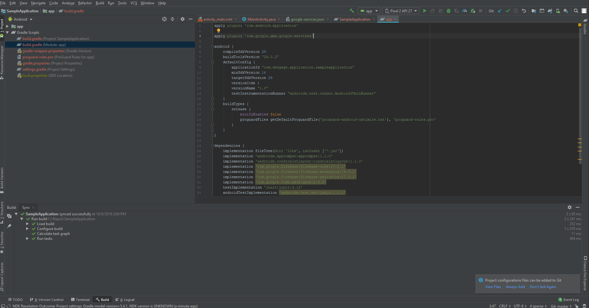

# Dengege Android SDK Setup

#### *Requirements*

* Google Firebase App Configuration
* dEngage Push Application Definition
* Android Studio
* Android Device or Emulator
* dengage.android.sdk.jar file

***dEngage Android SDK*** provides an interface which handles firebase push notification messages easily. Optionally, It also gives to send event functionality such as open and subscription to dEngage Platform.

Supports Android API level 4.1.x or higher.

## 1. Create Firebase App

1.1 Create a Firebase android app. https://console.firebase.google.com/u/1/project/dengagetest/overview


1.2 Download your configuration file (googles-services.json)


1.3 Add the following dependecies to build.gradle  ({project}/build.gradle):


1.4 Add the following dependecies to build.gradle  ({project}/{application}/build.gradle):



1.5 Copy the "com.dengage.sdk.jar" file to libs directory and Add as Library.

 

1.6 Add the following code on your AndroidManifest.xml file. (under the <application> node)

```xml
    <service
        android:name="com.dengage.sdk.notification.services.MessagingService">
        <intent-filter>
            <action android:name="com.google.firebase.MESSAGING_EVENT"/>
        </intent-filter>
    </service>
```

1.7 Make sure your app has the following permissions.

```xml
    <uses-permission android:name="android.permission.INTERNET" />
    <uses-permission android:name="android.permission.ACCESS_NETWORK_STATE" />
```

1.7 Run your app and verify your configuration.

 

## 2. Creating dEngage Push Application

2.1 Login your dEngage Panel. Navigate "Push Applications" page (https://app.dengage.com/#/pushApplications) and click the "Add > Android Application" button.


2.2 Visit your project settings page on Firebase console and navigate to Cloud Messaging page. And then copy your Server key and Sender ID.


2.3 Paste Your Server Key, Sender ID on your app settings and set your App Alias.
 
*** App Alias is a pointer that connects dEngage Push Application and Your Android application each other. It allows you to send push message to your app and report events to dEngage Platform. You can set your applicationId as an App Alias.


## 3. Implementing the SDK

3.1 Set your global variables on your MainActivicty

```java

private final String appAlias = "{YourAppAlias}"; // This is your App Alias which you set on dEngage Push Application settings page.
private static dEngageMobileManager mobileManager; // Instance for the dEngageMobileManager class. So you can access the variable globally.

```

3.2 Create an instance for dEnageMobileManager class.

```java
@Override
    protected void onCreate(Bundle savedInstanceState) {
        super.onCreate(savedInstanceState);
        setContentView(R.layout.activity_main);

        Context context = getApplicationContext();
        mobileManager = dEnageMobileManager.createInstance(appAlias, context);
        mobileManager.register(); // register to GCM.
    }
```


3.4 You will be able to send a push notification message to your app. dEngageMobileManager will handle the message with the default app configuration.


